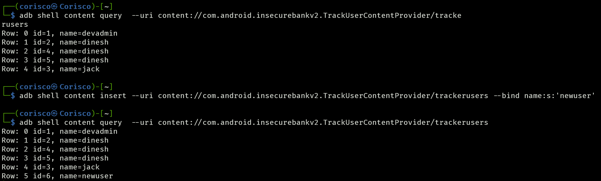

# InsecureBankv2 Pentest Report

**Table of Contents**
- [InsecureBankv2 Pentest Report](#insecurebankv2-pentest-report)
  - [1. Introduction](#1-introduction)
  - [2. Methodology](#2-methodology)
  - [3. Tools](#3-tools)
  - [4. Objective](#4-objective)
  - [5. Scope](#5-scope)
  - [6. Reconnaissance](#6-reconnaissance)
  - [7. Executive Summary](#7-executive-summary)
    - [7.1 Vulnerable Surface](#71-vulnerable-surface)
    - [7.2 Revealed Threats](#72-revealed-threats)
    - [7.4 Table of Vulnerabilities](#74-table-of-vulnerabilities)
    - [7.5 Recommendations](#75-recommendations)
  - [8. Vulnerabilities](#8-vulnerabilities)
    - [8.1 Hardcoded Backdoor Account](#81-hardcoded-backdoor-account)
    - [8.2 Insecure HTTP Connections](#82-insecure-http-connections)
    - [8.3 Plaintext Transmission of Sensitive Information](#83-plaintext-transmission-of-sensitive-information)
    - [8.4 Enumeration of Usernames via Endpoints](#84-enumeration-of-usernames-via-endpoints)
    - [8.5 Improper Access Control on Password Change](#85-improper-access-control-on-password-change)
    - [8.6 Binary Patching](#86-binary-patching)
    - [8.7 Sensitive Information Exposure in Logs](#87-sensitive-information-exposure-in-logs)
    - [8.8 Insecure Content Provider](#88-insecure-content-provider)
    - [8.9 Insecure Broadcast](#89-insecure-broadcast)
    - [8.10 Bypass of Root Detection](#810-bypass-of-root-detection)
    - [8.11 Bypassing Login to Access PostLogin Activity Directly](#811-bypassing-login-to-access-postlogin-activity-directly)
    - [8.12 Cross-Site Scripting (XSS) in ViewStatement](#812-cross-site-scripting-xss-in-viewstatement)
    - [8.13 Allow Backup Enabled](#813-allow-backup-enabled)
    - [8.14 Weak Cryptography in User Data Storage](#814-weak-cryptography-in-user-data-storage)
    - [8.15 Debugging Enabled](#815-debugging-enabled)
    - [8.16 Create User Button Activation through Hidden Value Manipulation](#816-create-user-button-activation-through-hidden-value-manipulation)

## 1. Introduction

This report details the results of a penetration test conducted by **Pedro Coelho** on the **[InsecureBankv2](https://github.com/dineshshetty/Android-InsecureBankv2)** Android application from 15 to 31 of August, 2024. The goal of this assessment was to uncover potential security vulnerabilities and evaluate the application’s overall security posture. Key areas of focus included static and dynamic analysis, network communications, and code vulnerabilities. Each finding is categorized and accompanied by mitigation recommendations to help improve the security of the application.

## 2. Methodology

This methodology is crafted with a focus on the specific needs of the InsecureBankv2 penetration test, drawing upon insights from the [OWASP Mobile Security Testing Guide (MASTG)](https://mas.owasp.org/MASTG/). By integrating established best practices with custom-tailored techniques, the approach ensures a comprehensive and effective assessment of the application’s security posture.

**1. Preparation**  
The scope and objectives for the pentest are defined. The testing environment is configured with the necessary settings to support comprehensive analysis.

**2. Reconnaissance**  
Initial information gathering is conducted to analyze the application's static and dynamic properties. Key areas such as permissions, configurations, and potential entry points are examined. External resources are also consulted to assess the reputation and security status of the application's components.

**3. Exploitation**  
The exploitation phase involves actively testing the application by attempting to exploit identified weaknesses. This includes analyzing network traffic for insecure communications, bypassing authentication mechanisms, reverse engineering the code to uncover vulnerabilities, and testing for privilege escalation. The goal is to validate the presence of vulnerabilities and assess their impact on the security of the application.

**4. Reporting**  
All identified vulnerabilities are documented with supporting evidence. Each vulnerability is linked to relevant OWASP Mobile Top 10 and CWE references, assessed for impact and severity, and assigned a CVSS score. Mitigation steps are provided to guide remediation.

The vulnerabilities are presented with the following structure: *Title, Description, Evidence, OWASP Mobile Top 10 Reference, CWE Reference, Impact, CVSS Score* and *Mitigation*.
   
## 3. Tools

- **[OWASP Mobile Top 10](https://owasp.org/www-project-mobile-top-10/)**
- **[OWASP Mobile Security Testing Guide](https://owasp.org/www-project-mobile-security-testing-guide/)**
- **[Common Weakness Enumeration (CWE)](https://cwe.mitre.org/)**
- **[Common Vulnerability Scoring System (CVSS) 4.0 Calculator](https://www.first.org/cvss/calculator/4.0)**
- **[Mobile Security Framework (MobSF)](https://github.com/MobSF/Mobile-Security-Framework-MobSF)**
- **[VirusTotal](https://www.virustotal.com/)**
- **[Genymotion Desktop](https://docs.genymotion.com/desktop/)**
- **[Jadx](https://github.com/skylot/jadx)**
- **[Burp Suite](https://portswigger.net/burp)**
- **[ADB (Android Debug Bridge)](https://developer.android.com/studio/command-line/adb)**
- **[Frida](https://frida.re/)**
- **[Objection](https://github.com/sensepost/objection)**
- **[Apktool](https://apktool.org/)**
- **[CyberChef](https://gchq.github.io/CyberChef/)**
- **[Kali Linux](https://www.kali.org/)**
- **[Docker](https://www.docker.com/)**
- **[VSCode](https://code.visualstudio.com/)**


## 4. Objective

The objective of this penetration test is to identify and assess security vulnerabilities within the InsecureBankv2 Android application. The assessment focuses on evaluating the app's security posture through comprehensive static and dynamic analysis, examining network communications, and scrutinizing code for potential vulnerabilities. The primary goal is to provide actionable insights and recommendations that enhance the security of the application, safeguard user data, and ensure compliance with industry security standards.

## 5. Scope

The scope of this penetration test is strictly confined to the InsecureBankv2 Android application and its direct network communications. The testing encompasses static analysis of the application's code and configuration files, dynamic analysis of its runtime behavior, and thorough examination of network traffic. The assessment deliberately excludes any external systems, third-party integrations, or external APIs associated with the application. This focus ensures a targeted evaluation of the application’s internal security mechanisms and data handling practices.

**Environment**  
- Host Machine: *Windows 11, Intel i7, 32GB RAM, with the latest security updates applied.*  
- Emulator: *Genymotion Desktop Version 3.7.1*, configured to emulate a *Samsung Galaxy S8* with *Android 10.0.*  
- Network Environment: The Genymotion emulator is connected to the internet via the host machine. A manual proxy is configured to route traffic through security testing tools. The InsecureBankV2 app communicates with an external server using the IP and port provided by the instructor.

For more setup details, refer to [readme](./readme.md).

## 6. Reconnaissance

**VirusTotal Overview**   

  

The APK file was analyzed on VirusTotal, where 12 out of 68 security vendors flagged it as malicious. Common labels included Trojan and Potentially Unwanted Program (PUP). The APK was last analyzed on August 3, 2024, with popular detections from vendors like Google, Sophos, and McAfee flagging potential spyware behavior. Additionally, the APK exhibited behaviors such as sending SMS, using obfuscation techniques, and checking for GPS and telephony data, which are often associated with malware or suspicious applications.

VirusTotal also provided a comprehensive view of the APK's reputation, certificate attributes, and contacted domains/IPs, which contributed to assessing the app's overall risk.


[Reference Link](https://www.virustotal.com/gui/file/b18af2a0e44d7634bbcdf93664d9c78a2695e050393fcfbb5e8b91f902d194a4)


**MobSF Analysis**

  

The MobSF static analysis identified critical security risks within the InsecureBankv2 Android application, such as the use of weak cryptography, exposed activities vulnerable to task hijacking, and the presence of debugging and backup functionalities that leave the app open to reverse engineering and data leakage. The analysis also revealed improper use of permissions, insecure components, and potential vulnerabilities like the Janus signature vulnerability.


- Applications Permissions: 
    ```
    android.permission.ACCESS_COARSE_LOCATION  
    android.permission.ACCESS_NETWORK_STATE  
    android.permission.GET_ACCOUNTS  
    android.permission.INTERNET  
    android.permission.READ_CONTACTS  
    android.permission.READ_PROFILE  
    android.permission.SEND_SMS  
    android.permission.USE_CREDENTIALS  
    android.permission.WRITE_EXTERNAL_STORAGE	  
    ```    
- Manifest Analysis:  

  - **Debugging Enabled**:  `android:allowBackup=true` The app's debug mode is enabled, which makes it more susceptible to reverse engineering and exploitation by attackers.
  - **Allow Backup**: `android:debuggable=true` Allowing the app's data to be backed up via adb presents a significant data leakage risk, especially in environments where USB debugging is enabled.
  - **Exported Components**: `PostLogin, DoTransfer, ViewStatement, TrackUserContentProvider` Several critical components are exported, making them accessible to other apps on the device, potentially exposing the app to unauthorized access and security risks.
  - **StrandHogg 2.0 Vulnerability**: `PostLogin, DoTransfer, ViewStatement, ChangePassword` Multiple activities  are vulnerable to task hijacking attacks.

  [Full MobSF Report](pdf/insecurebankv2.pdf)
  
**Jadx Analysis**

Jadx was used to decompile the APK, revealing hardcoded credentials, encryption implementations, authentication logic, app flow,  permissions and manifest configurations, providing insights into possible vulnerabilities in the app's code.  

- 

**Burp Suite Analysis**  
Burp Suite was employed to intercept network traffic and analyze HTTP requests made by the app. This provided insight into the app's communication patterns and any potential security weaknesses in the data being transmitted.  

- 


## 7. Executive Summary

The security assessment conducted on the InsecureBankv2 application aimed to thoroughly explore the vulnerabilities present in the Android application. The methodological approach focused on identifying and exploiting the weaknesses to their fullest extent, ensuring a deep understanding of the actual risks faced by the application. This in-depth approach enabled a comprehensive mapping of the vulnerable surface, an evaluation of the associated risks, and the proposition of mitigation measures for each identified vulnerability.

### 7.1 Vulnerable Surface

The application demonstrated an inadequate security posture, evidenced by the significant number of vulnerabilities discovered during the analysis. Among the flaws identified were critical vulnerabilities that could allow, for example, the interception of sensitive data transmitted without encryption and the exploitation of hardcoded credentials.

The analysis led to the identification of 16 vulnerabilities, classified as follows: 4 critical, 9 high, and 3 medium. 

- **Distribution of vulnerabilities according to the CVSS score severity**  
  


- **Distribution of vulnerabilities according to the OWASP Mobile Top 10**  
  


### 7.2 Revealed Threats
The most severe real threat scenarios identified by the analysis include:

- **Interception of Sensitive Data**: Critical vulnerabilities in the transmission of plaintext data could allow attackers to intercept sensitive information, such as login credentials, exposing users to account compromises and identity theft. This risk is exacerbated by the lack of encrypted communication channels (HTTP instead of HTTPS).

- **Unauthorized Access to Critical Features**: Through authentication and authorization flaws, such as the hardcoded backdoor account and improper access control on password change, attackers could directly access post-login activities, modify sensitive information, or even gain full access to user accounts without proper permissions.

- **Arbitrary Code Execution and Data Tampering**: Vulnerabilities related to insufficient binary protection, including bypassing root detection and enabling binary patching, could allow attackers to modify the application, insert malicious code, or access the application's core functionalities, thereby compromising the integrity of the application and the security of user data.

- **Data Leakage and Privacy Violations**: High vulnerabilities such as insecure content providers and the exposure of sensitive information in logs can lead to severe privacy violations and potential data breaches, allowing unauthorized access to user data.

### 7.4 Table of Vulnerabilities

| Vulnerability                                                                                           | Description                                                                | OWASP                                    | CVSS Score | CVSS Rating |
|------------------------------------------------------------------------------------------------|----------------------------------------------------------------------------|------------------------------------------|------------|-------------|
| [8.1 Hardcoded Backdoor Account](#81-hardcoded-backdoor-account)                               | Allows login without a password using a hardcoded account.                 | M1: Improper Credential Usage            | 9.3        | Critical    |
| [8.2 Insecure HTTP Connections](#82-insecure-http-connections)                                 | Communicates over HTTP, exposing data to MITM attacks.                     | M5: Insecure Communication               | 9.3        | Critical    |
| [8.3 Plaintext Transmission of Sensitive Information](#83-plaintext-transmission-of-sensitive-information) | Transmits sensitive data in plaintext, vulnerable to interception.         | M5: Insecure Communication               | 9.3        | Critical    |
| [8.4 Enumeration of Usernames via Endpoints](#84-enumeration-of-usernames-via-endpoints)       | Server responses reveal valid usernames, leading to enumeration.           | M3: Insecure Authentication/Authorization | 9.3        | Critical    |
| [8.5 Improper Access Control on Password Change](#85-improper-access-control-on-password-change) | Allows unauthorized users to change another user's password.               | M3: Insecure Authentication/Authorization | 8.6        | High        |
| [8.6 Binary Patching](#86-binary-patching)                                                   | APK can be modified and reinstalled, bypassing integrity checks.           | M7: Insufficient Binary Protection       | 8.5        | High        |
| [8.7 Sensitive Information Exposure in Logs](#87-sensitive-information-exposure-in-logs)     | Logs sensitive information in plain text, accessible via logcat.           | M9: Insecure Data Storage                | 8.5        | High        |
| [8.8 Insecure Content Provider](#88-insecure-content-provider)                               | Content Provider exposes sensitive user data without proper authorization. | M9: Insecure Data Storage                | 8.5        | High        |
| [8.9 Insecure Broadcast](#89-insecure-broadcast)                                             | Broadcast receiver reveals passwords, triggered by any app.                | M5: Insecure Communication               | 8.5        | High        |
| [8.10 Bypass of Root Detection](#810-bypass-of-root-detection)                                   | Root detection can be bypassed, exposing app to deeper attacks.            | M7: Insufficient Binary Protection       | 8.4        | High        |
| [8.11 Bypassing Login to Access PostLogin Activity Directly](#811-bypassing-login-to-access-postlogin-activity-directly) | Allows bypassing login to access protected activities directly.            | M3: Insecure Authentication/Authorization | 8.4        | High        |
| [8.12 Cross-Site Scripting (XSS) in ViewStatement](#812-cross-site-scripting-xss-in-viewstatement) | WebView is vulnerable to XSS attacks via modified HTML files.              | M5: Insecure Communication               | 8.3        | High        |
| [8.13 Allow Backup Enabled](#813-allow-backup-enabled)                                           | App data can be backed up via ADB, leading to data leakage.                | M9: Insecure Data Storage                | 7.0        | High        |
| [8.14 Weak Cryptography in User Data Storage](#814-weak-cryptography-in-user-data-storage)       | Weak encryption used for storing sensitive data in SharedPreferences.      | M9: Insecure Data Storage                | 6.9        | Medium      |
| [8.15 Debugging Enabled](#815-debugging-enabled)                                                 | App compiled in debug mode, vulnerable to reverse engineering.             | M8: Security Misconfiguration            | 5.1        | Medium      |
| [8.16 Create User Button Activation through Hidden Value Manipulation](#816-create-user-button-activation-through-hidden-value-manipulation) | Hidden 'Create User' button can be activated through code manipulation.    | M7: Insufficient Binary Protection       | 5.1        | Medium      |


### 7.5 Recommendations

To mitigate the identified vulnerabilities and enhance the security of the application, the following recommendations are proposed:

- **Eliminate Hardcoded Credentials**: Remove the hardcoded backdoor account and ensure that all user authentication processes are robust and secure. Implement mechanisms that prevent unauthorized access and enforce strong authentication protocols.

- **Encrypt Communications**: Transition from HTTP to HTTPS for all communications between the app and the server. This will protect sensitive data in transit from being intercepted and exploited by attackers. Regularly monitor and enforce the use of secure communication standards.

- **Strengthen Access Control**: Implement strict access control mechanisms across all sensitive activities within the app. Ensure that critical operations, such as password changes, are protected by proper authentication and authorization checks. Incorporate multi-factor authentication (MFA) where applicable.

- **Harden Application Security**: Disable debugging in production environments, reinforce root detection, and ensure that sensitive information is never logged in plain text. Implement stronger binary protection techniques to prevent unauthorized modifications to the app. Regularly review and secure all data storage practices to protect against unauthorized access and exposure.

- **Monitor and Respond to Security Anomalies**: Implement tamper-detection mechanisms to monitor for unusual application behavior that may indicate an attack. Upon detecting such activities, trigger a response such as logging the user out or disabling specific functionalities.

- **Regular Security Audits and Penetration Testing**: Conduct regular security audits and penetration tests to ensure that the application remains secure over time. These tests should focus on identifying new vulnerabilities and ensuring that all previously identified issues have been effectively mitigated.

## 8. Vulnerabilities

### 8.1 Hardcoded Backdoor Account

**Description**  
The app contains a hardcoded backdoor account using the username `devamin`, which allows login without a password. This vulnerability arises from the application’s improper credential management, where a specific condition in the code bypasses normal authentication.

**Evidence**  
- During static analysis using Jadx, the following code snippet was identified:
 

**OWASP Mobile Top 10 Reference**  
[M1: Improper Credential Usage](https://owasp.org/www-project-mobile-top-10/2023-risks/m1-improper-credential-usage.html)

**CWE Reference**  
[CWE-798: Use of Hard-coded Credentials](https://cwe.mitre.org/data/definitions/798.html)

**Impact**  
Unauthorized access to the application is possible without authentication, allowing complete control over user data and app functionality. This flaw severely compromises the security of the system.

**CVSS v4.0 Score**  
9.3 / Critical  
```
CVSS:4.0/AV:N/AC:L/AT:N/PR:N/UI:N/VC:H/VI:H/VA:N/SC:N/SI:N/SA:N
```

**Mitigation**  
Remove the hardcoded credentials and replace them with secure storage mechanisms, such as environment variables or encrypted storage. Ensure proper authentication processes are enforced for all users.


### 8.2 Insecure HTTP Connections

**Description**  
The application communicates with the server using the insecure `HTTP` protocol instead of `HTTPS`. This lack of encryption leaves all data transmitted between the client and the server vulnerable to interception by attackers via man-in-the-middle (MITM) attacks. Using HTTP without encryption compromises the confidentiality and integrity of the data, including non-sensitive information, increasing the overall security risk of the application.


**Evidence**  
Using Burp Suite, the HTTP traffic between the application and the server was intercepted. The traffic was transmitted without any encryption, allowing it to be easily captured and analyzed.

- Setup: A manual proxy was configured in the emulator’s WiFi settings, directing traffic through Burp Suite. The Burp Suite CA certificate was also installed later on the device to allow interception of the absent HTTPS traffic. HTTP traffic was intercepted and analyzed, revealing the unencrypted transmission of sensitive data.

  

    

- Captured HTTP Traffic: The traffic intercepted was entirely unencrypted, exposing all transmitted data.

    


**OWASP Mobile Top 10 Reference**  
[M5: Insecure Communication](https://owasp.org/www-project-mobile-top-10/2023-risks/m5-insecure-communication.html)

**CWE Reference**  
[CWE-319: Cleartext Transmission of Sensitive Information](https://cwe.mitre.org/data/definitions/319.html)


**Impact**  
An attacker intercepting this traffic can gain access to users' credentials, leading to potential account compromises, identity theft, and unauthorized access to sensitive user data.

**CVSS v4.0 Score**  
9.3 / Critical

```
CVSS:4.0/AV:N/AC:L/AT:N/PR:N/UI:N/VC:H/VI:H/VA:N/SC:L/SI:L/SA:N
```

**Mitigation**  
- Switch to HTTPS: Ensure all communications between the app and the server are encrypted using the HTTPS protocol.  
- Regularly Monitor and Enforce Security Standards: Continuously monitor network communications for compliance with security protocols.


### 8.3 Plaintext Transmission of Sensitive Information

**Description**  
The application transmits sensitive information, such as usernames and passwords, over the network in plaintext. This vulnerability allows attackers to intercept these credentials easily if they gain access to the network, especially in scenarios where the network is unsecured, such as public Wi-Fi. Even if HTTPS is not implemented, the transmission of sensitive information in plaintext exacerbates the risk.


**Evidence**  
During network traffic analysis with Burp Suite, the login credentials were intercepted and found to be transmitted in plaintext over the HTTP protocol.

- Captured Login Request: The intercepted request clearly shows the username and password being transmitted without any encryption.

    


**OWASP Mobile Top 10 Reference**  
[M5: Insecure Communication](https://owasp.org/www-project-mobile-top-10/2023-risks/m5-insecure-communication.html)

**CWE Reference**  
[CWE-319: Cleartext Transmission of Sensitive Information](https://cwe.mitre.org/data/definitions/319.html)


**Impact**  
An attacker intercepting this traffic can gain access to users' credentials, leading to potential account compromises, identity theft, and unauthorized access to sensitive user data.

**CVSS v4.0 Score**  
9.3 / Critical

```
CVSS:4.0/AV:N/AC:L/AT:N/PR:N/UI:N/VC:H/VI:H/VA:N/SC:L/SI:L/SA:N
```

**Mitigation**  
- Encrypt Sensitive Data: Always encrypt sensitive information before transmission, ideally by using HTTPS.  

- Implement Secure Communication Practices: Enforce secure coding practices that prevent sensitive information from being sent in plaintext.


### 8.4 Enumeration of Usernames via Endpoints

**Description**  
The application is vulnerable to username enumeration through `/login` and other endpoints. An attacker can determine whether a username is valid by observing the server's responses to login attempts and password change requests. This issue becomes critical when combined with the [password change vulnerability](#88-improper-access-control-on-password-change), allowing an attacker to identify valid usernames and then reset their passwords without the need for further credentials.

**Evidence**  
- Using Burp Suite’s Intruder tool, different usernames were tested against the `/login` endpoint. The application returned distinct responses for valid and invalid usernames:

    

- Invalid Username: The server responds with an error indicating the user does not exist.  
  
    
- Valid Username: The server either proceeds with the login process, confirming the username’s existence.
  
    

    

**OWASP Mobile Top 10 Reference**   
[M3: Insecure Authentication/Authorization](https://owasp.org/www-project-mobile-top-10/2023-risks/m3-insecure-authentication-authorization.html)

**CWE Reference**  
[CWE-203: Observable Discrepancy](https://cwe.mitre.org/data/definitions/203.html)

**Impact**  
This vulnerability allows attackers to identify valid usernames and, in combination with the password change flaw, reset passwords and gain unauthorized access to user accounts. This significantly increases the risk of account takeovers, data breaches, and unauthorized transactions.

**CVSS v4.0 Score**  
9.3 / Critical
```
CVSS:4.0/AV:N/AC:L/AT:N/PR:N/UI:N/VC:H/VI:H/VA:N/SC:L/SI:L/SA:N
```

**Mitigation**  

- Standardize Error Messages: Ensure that the server returns the same error message for both valid and invalid usernames.  
- Rate Limiting: Implement rate limiting on endpoints to slow down automated attacks.  
- Account Lockout: Introduce account lockout mechanisms after multiple failed attempts.  
- Multi-Factor Authentication: Implement MFA to protect accounts even if a username is compromised.  


### 8.5 Improper Access Control on Password Change

**Description**  
The application allows users to change another user's password by simply knowing their username. This vulnerability arises due to the lack of proper access control in the `/changepassword` endpoint. The application does not verify the identity of the user initiating the password change request, allowing any authenticated user to change the password of another user by sending a specially crafted request with the target's username.

**Evidence**  
By using Burp Suite, the password change request was intercepted and modified. The username of another user was entered along with a new password. The application accepted the request and changed the password of jack without any further validation. The request and response are shown below:

- Password Change Request/Response  

  

- Login with New Password  
After changing the password, an attempt was made to log in with the new password. The login was successful, confirming that the password change was executed.  

  

**OWASP Mobile Top 10 Reference**  
[M3: Insecure Authentication/Authorization](https://owasp.org/www-project-mobile-top-10/2023-risks/m3-insecure-authentication-authorization.html)

**CWE Reference**  
[CWE-306: Missing Authentication for Critical Function](https://cwe.mitre.org/data/definitions/306.html)

**Impact**  
This vulnerability allows an attacker to compromise the account of any user simply by knowing their username. The attacker can reset the user's password and gain full access to their account, leading to potential data theft, unauthorized transactions, or further attacks within the application. This poses a critical risk to the application's security and user privacy.


**CVSS v4.0 Score**   
8.6 / High  
 
```
CVSS:4.0/AV:N/AC:L/AT:N/PR:L/UI:N/VC:H/VI:H/VA:N/SC:N/SI:N/SA:N
```

**Mitigation**  
- Implement Proper Access Control: Ensure that the user initiating the password change request is the same user whose password is being changed. This can be done by requiring authentication and verifying session tokens or using OAuth 2.0 mechanisms.  
  
- Use Multi-factor Authentication (MFA): Implement MFA for sensitive operations like password changes to ensure additional layers of security.  
  
- Require Current Password: Enforce a policy where users must provide their current password to change their password, reducing the risk of unauthorized changes.  
  


### 8.6 Binary Patching

**Description**  

The application was modified through binary patching, where the APK was decompiled, specific code sections were altered, and then recompiled. This allowed for the reinstallation of the modified APK on the Android device, bypassing any integrity checks or security mechanisms. Such modifications can be used to introduce malicious functionality, enable hidden features, or remove security controls.

**Evidence**  

- The APK was decompiled using Apktool:

  ```bash
  apktool d -r InsecureBankv2.apk
  ```
- Specific code was modified to alter the application's behavior, as shown in the decompiled code snippet:
  
  

- The value on the LoginActivity.smali, setVisibility was set to 0x0, making the "Create User" button visible in the application, refer to [8.12 Create User Button Activation through Hidden Value Manipulation](#812-create-user-button-activation-through-hidden-value-manipulation):

  

- The modified APK was recompiled and signed with a new key:

  ```bash
  pktool InsecureBankv2 -o IB-2.apk

  keytool -genkey -v -keystore android.keystore -alias keydroid -keyalg RSA -keysize 2048 -validity 10000

  apksigner sign --ks-key-alias keydroid --ks android.keystore ib3.apk
  ```

- The APK was successfully reinstalled on the emulator, demonstrating the feasibility of this attack.

**OWASP Mobile Top 10 Reference**  
[M7: Insufficient Binary Protection](https://owasp.org/www-project-mobile-top-10/2023-risks/m7-insufficient-binary-protection.html)

**CWE Reference**  
[CWE-494: Download of Code Without Integrity Check](https://cwe.mitre.org/data/definitions/494.html)

**Impact**  
An attacker with access to the APK file can modify its functionality and repackage it, potentially introducing malicious code or enabling hidden features. This compromises the integrity of the application and poses significant security risks, including data theft, unauthorized access, or the propagation of malware.

**CVSS v4.0 Score**  
8.5 / High
```
CVSS:4.0/AV:L/AC:L/AT:N/PR:N/UI:N/VC:H/VI:H/VA:N/SC:N/SI:N/SA:N
```

**Mitigation**  
- Implement strong integrity checks, such as using a combination of hash validation and certificate pinning, to prevent the installation of modified APKs.
- Employ obfuscation and anti-tampering techniques to make binary patching more difficult.
- Monitor for unusual application behavior that may indicate tampering.


### 8.7 Sensitive Information Exposure in Logs

**Description**  
The application logs sensitive information, including the username and password, in plain text during the login process. This occurs in the `DoLogin` activity, where user credentials are captured and written to the log for debugging purposes. Logging sensitive information poses a significant security risk, as it can be easily accessed by anyone with access to the device's log files, including malicious apps or users with physical access.


**Evidence**  
- The `DoLogin` activity logs the username and password during the login process. The following code snippet from the decompiled APK using Jadx shows the logging of sensitive information.  
  
    

- Using `adb logcat`, the sensitive information was retrieved from the logs as follows:  
  
  

**OWASP Mobile Top 10 Reference**  
[M9: Insecure Data Storage](https://owasp.org/www-project-mobile-top-10/2023-risks/m9-insecure-data-storage.html)

**CWE Reference**  
[CWE-532: Insertion of Sensitive Information into Log File](https://cwe.mitre.org/data/definitions/532.html)

**Impact**  
Logging sensitive information such as usernames and passwords exposes users to significant risks, including account compromise and identity theft. If an attacker gains access to the logs, they can easily extract these credentials and use them to gain unauthorized access to the application or other services where the user might have reused the same credentials.

**CVSS v4.0 Score**  
8.5 / High
```
CVSS:4.0/AV:L/AC:L/AT:N/PR:N/UI:N/VC:H/VI:H/VA:N/SC:N/SI:N/SA:N
```

**Mitigation**  

- Remove Sensitive Data from Logs: Ensure that sensitive information, such as usernames, passwords, and tokens, is never logged. Replace any existing logging of such data with generic information or remove the logging statements altogether.

- Secure Logging Practices: Implement secure logging practices that filter or mask sensitive information before it is written to the logs.

- Use Secure Storage for Debug Information: If sensitive information must be logged for debugging purposes during development, ensure that it is stored securely and removed before the application is released to production.


### 8.8 Insecure Content Provider

**Description**  
The `TrackUserContentProvider` in the application is improperly secured, allowing unauthorized access to sensitive user data. Content Providers in Android are components that manage access to a structured set of data. However, when not secured properly, they can expose this data to other apps or malicious actors. In this case, the `TrackUserContentProvider` allows access to sensitive information such as user names, IDs, and potentially other user-related data without requiring proper authentication or authorization.

**Evidence**  

- Content Provider Class `TrackUserContentProvider`
The decompiled source code reveals that the content provider lacks any security checks, making it vulnerable to unauthorized access.  

  
- ADB Content Queries
Using ADB commands, it was possible to retrieve user information stored in the content provider. The following query demonstrates how an attacker can extract and modify data without any authentication:


**OWASP Mobile Top 10 Reference**  
[M9: Insecure Data Storage](https://owasp.org/www-project-mobile-top-10/2023-risks/m9-insecure-data-storage.html)

**CWE Reference**  

[CWE-200: Exposure of Sensitive Information to an Unauthorized Actor:](https://cwe.mitre.org/data/definitions/200.html)  

[CWE-276: Incorrect Default Permissions](https://cwe.mitre.org/data/definitions/276.html)

**Impact**  
The exposure of the `TrackUserContentProvider` to unauthorized access can lead to severe privacy violations and potential data breaches. Attackers can query sensitive user data, modify it, or even delete it, leading to loss of data integrity and privacy. In a banking application, this could result in identity theft, unauthorized transactions, and other malicious activities.

**CVSS v4.0 Score**  
8.5 / High
```
CVSS:4.0/AV:L/AC:L/AT:N/PR:N/UI:N/VC:H/VI:H/VA:N/SC:L/SI:L/SA:N
```

**Mitigation**  
- Implement Proper Authentication and Authorization: Ensure that the `TrackUserContentProvider` requires proper authentication and authorization before allowing any access to its data. This can be achieved by implementing permission checks and restricting access to only trusted applications.

- Encrypt Sensitive Data: Encrypt any sensitive data stored within the content provider to add an additional layer of security, ensuring that even if access is obtained, the data remains secure.

- Use Secure Content Providers: Consider using the ContentProvider class's built-in mechanisms for securing data access, such as implementing the `getReadPermission()` and `getWritePermission()` methods to enforce access control.


### 8.9 Insecure Broadcast

**Description**  
The application contains a broadcast receiver `MyBroadCastReceiver` that processes sensitive information, including usernames and passwords. This broadcast is triggered when a password change attempt is made, capturing the new password and sending an SMS message with the old and new passwords included. However, the actual password change is not performed on the server-side. Since this broadcast can be triggered by any app or entity with knowledge of the broadcast action, it poses a significant security risk by revealing the password of the currently logged-in user. The sensitive data is logged in the device logs and can be intercepted by malicious actors.

**Evidence**  
- The broadcast receiver decrypts and retrieves the current user's password from the shared preferences, then sends it via SMS along with the new password provided in the broadcast.  
  
  

  

- When the broadcast is triggered, the current user's password is revealed in the SMS message and the logcat output, making it accessible to anyone with access to the device logs.  
  
  

  

**OWASP Mobile Top 10 Reference**  
[M5: Insecure Communication](https://owasp.org/www-project-mobile-top-10/2023-risks/m5-insecure-communication.html)

**CWE Reference**  
[CWE-925: Improper Verification of Intent by Broadcast Receiver](https://cwe.mitre.org/data/definitions/925.html)  
[CWE-200: Exposure of Sensitive Information to an Unauthorized Actor](https://cwe.mitre.org/data/definitions/200.html)

**Impact**  
This vulnerability allows attackers to intercept sensitive user information, such as passwords, simply by triggering the broadcast receiver. This can lead to account compromise, unauthorized access, and potential identity theft. The exposure of this data in logs further exacerbates the risk, as it could be accessed by malicious applications or users with physical access to the device.

**CVSS v4.0 Score**  
8.5 / High
```
CVSS:4.0/AV:L/AC:L/AT:N/PR:N/UI:N/VC:H/VI:H/VA:N/SC:N/SI:N/SA:N
```

**Mitigation**  
- Secure Broadcasts: Ensure that sensitive broadcasts are protected by enforcing proper permissions or utilizing secure messaging channels that prevent unauthorized apps from accessing or triggering them.
  
- Encrypt Sensitive Data: Avoid sending sensitive information like passwords in plain text via SMS. Instead, use secure, encrypted channels to transmit sensitive data.
  
- Log Management: Ensure that sensitive information is not logged, and review all log statements to remove or obscure any sensitive data before deploying the application.
  
- Server-Side Validation: Implement server-side validation for all password changes to ensure that password modifications are legitimate and that sensitive data is not unnecessarily exposed.


### 8.10 Bypass of Root Detection

**Description** 

The application implements a basic root detection mechanism in the `PostLogin` activity by checking the existence of the su binary and the Superuser.apk file. This detection can be easily bypassed using tools such as Frida and Objection. By dynamically hooking and modifying the return values of the `doesSUexist()` and `doesSuperuserApkExist()` methods, the app can be tricked into believing that the device is not rooted.


**Evidence**  

- Application Displays Rooted Status  
Before the bypass, the application detects that the device is rooted and displays the message `Rooted Device!!`.  

  
- Root Detection Code in Jadx  
The root detection logic is implemented in the `PostLogin` activity and is based on checking the existence of the `su` binary and `Superuser.apk` file.  
    

- Frida Server Running  
The Frida server is successfully running on the device, allowing runtime hooking of methods for bypassing the root detection.    
  

- Objection Command for Root Detection Bypass  
Using Objection, the root detection checks were bypassed by setting the return values of the `doesSUexist()` and `doesSuperuserApkExist()` methods to false.

  ```bash
  objection -g com.android.insecurebankv2 explore
  ```  

  `android hooking set return_value <class.method> <value>`
  ```bash
  android hooking set return_value com.android.insecurebankv2.PostLogin.doesSUexist false
  android hooking set return_value com.android.insecurebankv2.PostLogin.doesSuperuserApkExist false
  ```  
  

- Application Displays Not Rooted Status
After bypassing the root detection, the application now displays the message `Device not Rooted!!`, indicating that the root detection has been successfully disabled.  

  

**OWASP Mobile Top 10 Reference**  
[M7: Insufficient Binary Protection](https://owasp.org/www-project-mobile-top-10/2023-risks/m7-insufficient-binary-protection.html)

**CWE Reference**  
[CWE-489: Active Debug Code](https://cwe.mitre.org/data/definitions/489.html)  
[CWE-602: Client-Side Enforcement of Server-Side Security](https://cwe.mitre.org/data/definitions/602.html)


**Impact**  
By bypassing root detection, attackers gain full access to the application’s features on a rooted device, leading to increased risks of data exposure, tampering, and reverse engineering. Rooted devices provide deep access to the system and app data, which would normally be protected. When root detection is bypassed, attackers can: extract sensitive data, modify the app or alter its behavior, circumvent security measures that protect the app in non-rooted environments and exploit other vulnerabilities more easily due to elevated privileges
  
The primary concern is that bypassing root detection allows attackers to operate with the privileges of a rooted device, while the application remains unaware and continues to function as though it were in a secure, non-rooted environment.

**CVSS v4.0 Score**  
8.4 / High
```
CVSS:4.0/AV:L/AC:L/AT:N/PR:L/UI:N/VC:H/VI:H/VA:N/SC:N/SI:N/SA:N
```

**Mitigation**  
- Stronger Root Detection: Use advanced root detection techniques or approaches that check system integrity, detect root management tools, and look for tampering with system files.
- Server-Side Enforcement: Implement server-side validation to enforce security measures and monitor for tampering or bypass attempts, ensuring security remains intact even if client-side detection is bypassed.
- Tamper Detection: Add tamper-detection mechanisms to detect runtime manipulation or debugging, preventing tools from altering app behavior.
- Monitor and Respond: Monitor app behavior for anomalies. Upon detecting tampering, trigger a response like logging the user out or disabling functionality.


### 8.11 Bypassing Login to Access PostLogin Activity Directly

**Description**  
The application allows an attacker to bypass authentication and directly access sensitive activities, such as `PostLogin`, by using simple ADB commands. This vulnerability arises because the app does not enforce proper access control on activities, leaving them accessible even without proper authentication.

An attacker can exploit this issue by launching these activities directly, bypassing the login mechanism and accessing sensitive functionalities.


**Evidence**  
- The following ADB command was executed to directly launch the `PostLogin` activity without authentication:  

  ```bash
  adb shell am start -n com.android.insecurebankv2/com.android.insecurebankv2.PostLogin
  ```

- Command Execution:  
  
    

- Resulting Screen (PostLogin Activity):  
  
  

**OWASP Mobile Top 10 Reference**  
[M3: Insecure Authentication/Authorization](https://owasp.org/www-project-mobile-top-10/2023-risks/m3-insecure-authentication-authorization.html)

**CWE Reference**  
[CWE-306: Missing Authentication for Critical Function](https://cwe.mitre.org/data/definitions/306.html)

**Impact**  
An attacker can bypass authentication and directly access critical functionalities, such as transferring funds, without needing to log in. This compromises the confidentiality and integrity of the application, allowing unauthorized users to manipulate sensitive features.

**CVSS v4.0 Score**  
8.4 / High
```
CVSS:4.0/AV:L/AC:L/AT:N/PR:L/UI:N/VC:H/VI:H/VA:N/SC:N/SI:N/SA:N
```

**Mitigation**  
- Enforce Access Control: Ensure that all sensitive activities are accessible only after proper user authentication.

- Activity Lifecycle Validation: Implement checks within the lifecycle methods of all sensitive activities to verify the user's authentication status and redirect unauthenticated users to the login screen.

- Prevent External Access: Secure all activities by preventing them from being launched externally through ADB or other methods unless proper permissions are verified.


### 8.12 Cross-Site Scripting (XSS) in ViewStatement

**Description**  
The ViewStatemen feature in the application is vulnerable to Cross-Site Scripting (XSS) due to improper handling of user-generated content within the `WebView`. The application loads HTML files named `Statements_{username}.html` from external storage and renders them in a WebView with JavaScript enabled. Since these HTML files are stored in external storage, they can be modified by other applications or users with access to the file system. An attacker could inject malicious JavaScript code into these files, which would then be executed when the victim views their statement within the app.

**Evidence**  
- Code Analysis: The ViewStatement activity loads HTML files from external storage and renders them in a `WebView` with JavaScript enabled.  
  
      

- Using `adb logcat`, the HTML file path and content were confirmed.

  

- XSS Proof of Concept: By injecting the following script into the HTML file, the attack was successfully executed when the user viewed the statement  

  ```
  <script>alert("XSS")</script>
  ```
  
    

  


- Another example of redirection via JavaScript:  
  
  ```
  <script>
      window.location.href = "https://google.com/";
  </script>
  ```
  

**OWASP Mobile Top 10 Reference**  
[M5: Insecure Communication](https://owasp.org/www-project-mobile-top-10/2023-risks/m5-insecure-communication.html)

**CWE Reference**  
[CWE-79: Improper Neutralization of Input During Web Page Generation ('Cross-site Scripting')](https://cwe.mitre.org/data/definitions/79.html)

**Impact**  
The impact of this vulnerability is significant, as it allows attackers to execute arbitrary JavaScript within the context of the application's WebView. This can lead to:

- Session Hijacking: The attacker could steal session cookies or tokens, allowing them to impersonate the victim.
- Data Theft: Sensitive information, such as user credentials, could be extracted and sent to a remote server.
- Phishing Attacks: The attacker could redirect the user to a malicious site that mimics the legitimate application to steal further credentials.
- Device Exploitation: If the WebView has elevated privileges, the attacker could perform more extensive attacks on the device.


**CVSS v4.0 Score**  
8.3 / High
```
CVSS:4.0/AV:L/AC:L/AT:N/PR:N/UI:A/VC:H/VI:H/VA:N/SC:L/SI:L/SA:N
```

**Mitigation**  
- Disable JavaScript: If JavaScript is not necessary for the functionality, disable it in the WebView using `mWebView.getSettings().setJavaScriptEnabled(false);`.
- Sanitize Input: Ensure that any content loaded into the WebView is sanitized to remove or escape any potential JavaScript code before rendering.
- Use Internal Storage: Avoid storing sensitive files like statements in external storage, where they can be modified by other applications. Instead, store them in a secure internal storage location.
- Content Security Policy (CSP): Implement a Content Security Policy to restrict the sources from which JavaScript can be loaded and executed within the WebView.
- Review WebView Configuration: Audit and configure WebView settings to minimize exposure, such as disabling form autofill and restricting access to potentially dangerous APIs.


### 8.13 Allow Backup Enabled

**Description**  
The `android:allowBackup` flag is set to `true` in the `AndroidManifest.xml` file. This setting allows the app's data to be backed up via ADB without requiring the user's consent. If an attacker gains access to the device, they can extract the app's private data by using ADB backup functionality, which could result in data leakage or exposure of sensitive information.

**Evidence**  
- During static analysis using Jadx, the following code snippet was found in the `AndroidManifest.xml` file:  
  
    

- You can further verify this by running the following ADB command:   
  
  

  

**OWASP Mobile Top 10 Reference**  
[M9: Insecure Data Storage](https://owasp.org/www-project-mobile-top-10/2023-risks/m9-insecure-data-storage.html)

**CWE Reference**  
[CWE-530: Exposure of Backup File to an Unauthorized Control Sphere](https://cwe.mitre.org/data/definitions/530.html)

**Impact**  
An attacker who gains access to the device or ADB can extract and analyze the backup of the app, leading to the exposure of sensitive user information, including login credentials, private files, and cached data.

**CVSS v4.0 Score**  
 7.0 / High
```
CVSS:4.0/AV:L/AC:L/AT:N/PR:N/UI:N/VC:H/VI:L/VA:N/SC:N/SI:N/SA:N
```

**Mitigation**  
To mitigate this risk, set `android:allowBackup="false"` in the `AndroidManifest.xml` file:

```
<application
    android:allowBackup="false">
</application>
```
This will prevent the app's data from being backed up by ADB, thereby protecting the app’s sensitive data from unauthorized extraction.


### 8.14 Weak Cryptography in User Data Storage


**Description**  
The app stores sensitive information such as usernames and passwords in the `mySharedPreferences.xml` using weak encryption. While the data appears encrypted at first glance, further inspection reveals a hardcoded cryptographic key and an insecure implementation of `AES (Advanced Encryption Standard)` in `Cipher Block Chaining (CBC)` mode. An attacker with access to the device can easily retrieve and decrypt this data, leading to the exposure of sensitive user information.

**Evidence**  

- Access to Encrypted Data via ADB  
Using ADB, the app's shared preferences file `mySharedPreferences.xml` was accessed, which stores encrypted usernames and passwords.  

- Decryption Process  
Upon inspecting the app's source code using Jadx, the `CryptoClass.java` file was identified, revealing the hardcoded cryptographic key used for encryption:  


- This key, along with a static `Initialization Vector (IV)`, was used in `AES/CBC` mode to encrypt the stored data. Using these values, the data was easily decrypted using CyberChef.   
 
    
    
    


**OWASP Mobile Top 10 Reference**  
[M9: Insecure Data Storage](https://owasp.org/www-project-mobile-top-10/2023-risks/m9-insecure-data-storage.html)

**CWE Reference**  
[CWE-327: Use of a Broken or Risky Cryptographic Algorithm](https://cwe.mitre.org/data/definitions/327.html)
[CWE-798: Use of Hard-coded Credentials](https://cwe.mitre.org/data/definitions/798.html)  

**Impact**  
An attacker with access to the device can decrypt sensitive user information stored in the app's SharedPreferences. This vulnerability compromises the confidentiality of usernames, passwords, and other private information, potentially leading to account takeover or other security breaches.

**CVSS v4.0 Score**  
6.9 / Medium
```
CVSS:4.0/AV:L/AC:L/AT:N/PR:L/UI:N/VC:H/VI:L/VA:N/SC:N/SI:N/SA:N
```

**Mitigation**  

- Use Strong Cryptography: Replace the hardcoded cryptographic key with dynamically generated keys stored securely using the Android Keystore system.  

- Secure Initialization Vectors (IV): Generate a random IV for each encryption operation instead of using a static IV to ensure the ciphertext is unique for each encrypted data item.  

- Use EncryptedSharedPreferences: Utilize Android's EncryptedSharedPreferences for securely storing sensitive information like usernames and passwords, which handles encryption properly and securely.   

- Remove Hardcoded Credentials: Eliminate hardcoded keys from the codebase to prevent easy decryption and exposure of sensitive data by attackers.


### 8.15 Debugging Enabled

**Description**  
The `android:debuggable` flag is set to `true` in the `AndroidManifest.xml` file, indicating that the app is compiled in debug mode. This leaves the app vulnerable to reverse engineering and unauthorized access using tools such as Android Debug Bridge (ADB). In production environments, leaving this flag enabled increases the risk of attacks, allowing attackers to intercept and manipulate app data and behavior.

**Evidence**  
During static analysis using Jadx, the following code snippet was found in the `AndroidManifest.xml` file:


**OWASP Mobile Top 10 Reference**  
[M8: Security Misconfiguration](https://owasp.org/www-project-mobile-top-10/2023-risks/m8-security-misconfiguration.html)

**CWE Reference**  
[CWE-489: Active Debug Code](https://cwe.mitre.org/data/definitions/489.html)

**Impact**  
An attacker can attach a debugger to the app, inspect and modify its runtime behavior, access sensitive data, and bypass security controls, putting the app and user data at significant risk.

**CVSS v4.0 Score**  
5.1 / Medium
```
CVSS:4.0/AV:L/AC:L/AT:N/PR:N/UI:N/VC:L/VI:L/VA:N/SC:N/SI:N/SA:N
```
**Mitigation**  
 Ensure that the `android:debuggable` flag is set to `false` for production releases. The following line should be added or modified in the `AndroidManifest.xml`:

```
<application
    android:debuggable="false">
</application>
```
This will prevent attackers from attaching a debugger to the application in production environments.


### 8.16 Create User Button Activation through Hidden Value Manipulation

**Description**  

The application contains a hidden `Create User` feature that is not intended to be accessible by users. However, through manipulation of a hidden value in the APK code, this feature can be activated. Although the feature does not successfully allow the creation of a new user, its presence and potential activation illustrate a significant security vulnerability that could lead to unintended access to application features or expose sensitive operations.

**Evidence**  

- The hidden value controlling the visibility of the `Create User` button was identified and altered in the decompiled APK code, refer to [8.11 Binary Patching](#811-binary-patching), after recompiling and reinstalling the APK, the button was made visible in the application:  

    

  

- Attempting to create a user resulted in an error, as the feature is not fully functional, but the presence of the button illustrates the potential for feature exposure.

  

**OWASP Mobile Top 10 Reference**  
[M7: Insufficient Binary Protection](https://owasp.org/www-project-mobile-top-10/2023-risks/m7-insufficient-binary-protection.html)

**CWE Reference**  
[CWE-912: Hidden Functionality](https://cwe.mitre.org/data/definitions/912.html)

**Impact**  
The ability to activate hidden features through code manipulation poses a security risk by exposing parts of the application that were not intended for user interaction. This can lead to unintended access to sensitive functions, compromising the security of the application and potentially enabling further exploitation.

**CVSS v4.0 Score**  
5.1 / Medium
```
CVSS:4.0/AV:L/AC:L/AT:N/PR:N/UI:N/VC:N/VI:L/VA:N/SC:N/SI:N/SA:N
```

**Mitigation**  
- Remove or securely disable any code related to hidden or debug features before deploying the application.
- Ensure that feature toggles are properly secured and inaccessible through simple code modification or reverse engineering.
- Regularly audit the application for the presence of unintended features or code paths that should not be accessible in production environments.

---
**Author: Pedro Coelho** 

CESAR School  
Specialization in Cybersecurity  
Mobile Application Security Course  
Instructor: Erick Nascimento  

Recife, 2024